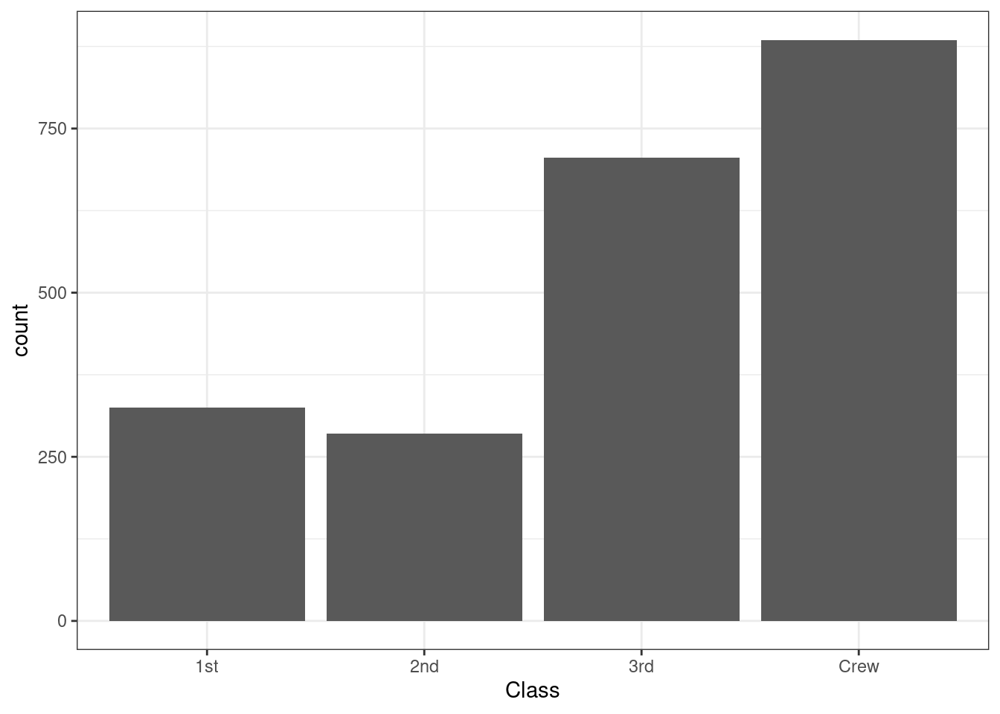
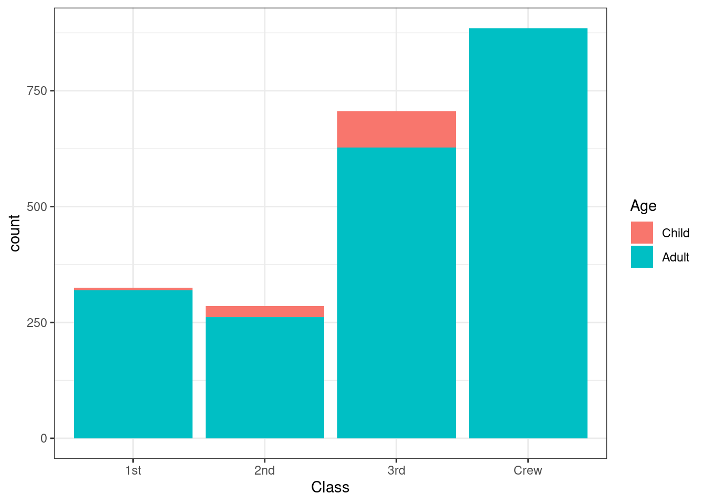
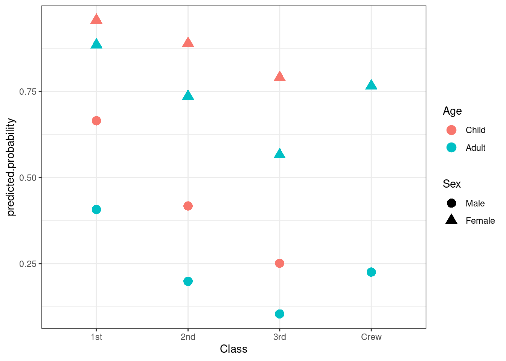

# Going Through a Project from Start to Finish

To start off, we're going to look at an example analysis. This will go step-by-step through loading data, exploring the dataset, running a regression, and commuicating the results. You may not understand everything and this point, but you'll start to get familiar with R's syntax and won't have to wait 100 pages before trying out something useful. The following chapters will look at each step in detail to explain exactly what is happening, how it relates to STATA commands, and why we're doing it this way. 

*Note:* A great way to learn a programming language is to start with something that works and then break it. Modify a part of the code and see what
changes. Did it do what you expected? Did you get an error message? Playing with the code can help you figure out what each component is doing, 
why it does it that way, and how you can manipulate it to do what you want.

## Loading packages
Once R is installed, you now have what is called base-R. Base-R comes ready to go with a number of statistical functions, visualizations, and even some sample datasets. There is, however, plenty more that can be done by loading additional packages. Packages are developed by the comunity of R users and typically hosted on CRAN (The **C**omprehensive **R** **A**rchive **N**etwork). For effeciency, additional packages have to be installed and then loaded when you want to use them. R doesn't automatically install or load additional packages as this would take up *a lot* of memory with packages that you'll never use. 

If a package exists on CRAN, it can be installed by writing 

```install.packages("package.name").```

Most packages that you'll want to use will be hosted on CRAN, but occasionally, new packages that are being developed are only on GitHub. If this is the case, the authors will include instructions on how to install the package in the README.md file of the GitHub repository. 

You only have to intall a package once, but you have to call it everytime you open R. It's the norm to list all of the packages that you'll be using at the very top of you R script. You call a package with the command 

```library(package.name)```

For this example, were going to use the package `modelsummary` for making regression tables, `dplyr` for data manipulation and pipes (`%>%`), which allow us to string commands together, `tidyr` for datat cleaning and wrangling, and `ggplot2` for making graphs. We can import `dplyr`. `tidyr`, and `ggplot2`,  by calling `tidyverse`^[For more information on the tidyverse and how to use the various packages, see [*R for Data Science*](https://r4ds.had.co.nz/index.html), by Hadley Wickham & Garrett Grolemund.], which automatically loads a collection of packages. So starting out, our script should look like this:

```r
library(modelsummary)
library(tidyverse)
```

## Loading and prepping the data
For this example, we are going to use one of the preloaded datasets that comes with R. While you'll never use one of these datasets for actual research, it's easier to use something that everyone already has to get started with an example. The next chapter will show you how to load data in STATA's .dta format, as well as other common formats. 

For this example, we'll use the *Titanic* dataset. This will be obnoxiously familiary for anyone that has done some tutiorials on machine learning. For those unfamiliar, it contains variables on the age, gender, and ticket class for those that were on the titanic, as well as whether or not they survived. To access the data, we type `data("Titanic")`. You should now see `Titanic` in the `Enivronment` tab in RStudio. It's not quite ready yet, however, as it is not in a `data.frame` or `tibble` format. If we type `class(Titanic)`, we see that it's `table`. This can be converted with the commands `data.frame(Titanic)` or `as_tibble(Titanic)` 

For this example, let's convert the table into a data frame. If you type `data.frame(Titanic)`, the table will be converted to a data frame, and then printed into the console. We don't want this. We want to store the data frame as an object that we can analyze. In R, you store an object by first typing a name of you choosing, followed by the assignment operator (`<-`) and then what you want to be stored as the object. It's best to choose descriptive names for objects, so it's easy to remember what they are. Let's use `titanic.data`. The code should look like this:


```r
data("Titanic")
titanic.data <- data.frame(Titanic)
```
You should now see an object called `titanic.data` in you  `Environment` with 32 observations or 5 variables. If we want to look at the entire dataset, we can type `View(titanic.data)`. If we only want to see the first few rows, we can type `head(titanic.data)` and the last few rows can be seen with `tail(titanic.data)`. A frequency table can be seen with `table(titanic.data)`. Let's check that out.
```
table(titanic.data)
```

As you can see, it's hard to glean any information from this as frequency is already a variable, with the other variables being collapsed. We can treate a subset without frequency by typing `titanic.subset <- titanic.data[(1:4)]`. This creates a new data frame called `titanic.subset` with only contains the first four columns of the `titanic.data` data frame. Now trying `table(titanic.subset)`, we see eveything has a ferequency of one. To use this data for a regression, let's expand it so that we have one observation for everyone that was on board. We can do this using the `tidyr` function `uncount()`. This function expands
the data frame, based on a variable. The syntax is 
```
uncount(data, weights, .remote = TRUE, .id = NULL)
```
where `data` is the data frame `weights` is the variable that has the count of rows to duplicate, `.remove` deletes the variable supplied to `weights` (TRUE by defalut) and `.id`  creates a new ID for each row. For our data, let's type:

```r
titanic.expanded <- uncount(titanic.data, Freq)
```
Now let's explore our expanded data. We already used `View()` to look at the full dataset, but with 2201 observations, it can be hard to tell much about what going on. Instead, we're going to generate summary statistics with `summary(titanic.expanded)`. This shows of the level of each variable, the number of ovservations at the level, and, implicitly, that there are no missing values. If there were missing values, the last row of each variable would read `NA's:` followed by the number of rows for which that variable didn't have a value. 

Now that we have a data frame that we can analyze, we no longer need the original data, or the subset we created. We can get rid of these with `rm(list = c('Titanic', 'titanic.data', 'titanic.subset'))`. R can use a lot of memory on your computer, so it's best to get rid of any objects that you're no longer using. 

## Visualization
Let's look at our data using some plots. First, we're going to check the distribution of our variables. Given that all of our variables are factors, a histogram is the was to go. Using `ggplot2`, we can do this:

```r
ggplot() +
    geom_histogram(data = titanic.expanded, 
        aes(x = Class), stat = 'count') +
    theme_bw()
```

```
## Warning: Ignoring unknown parameters: binwidth, bins, pad
```


The above calls a plot (`ggplot()`) and then says that we're going to make a histogram (`geom_histogram()`). We're going to use the `titanic.expanded` data, and we want to see the variable `Class`. `aes()` is responsible for creating the mapping, in other words, with the variables that are being plotted. We include `stat = 'count'` as we're looking at the frequenqy of each level of the variable `Class`. Finally, `theme_bw()` styles the graph. This part is optional, and there are plenty of other themes you can choose from, including custom themes that you can make yourself. `ggplot2` uses the [*grammar of graphics*](http://vita.had.co.nz/papers/layered-grammar.pdf) which layers different aspects of a visualiztion on top of each other. Each layer is connected with a `+`. While you could keep everything on one line and the code will still run, it is best to end each line with a `+` and the start on the next line with an indent. This keeps the code organized and easy to read. 

Now say you also wanted to show how many within each class were chilren and how many were adults. This could be done by changing the `fill`. 

```r
ggplot() +
    geom_histogram(data = titanic.expanded, 
        aes(x = Class, fill = Age), stat = 'count') +
    theme_bw()
```

```
## Warning: Ignoring unknown parameters: binwidth, bins, pad
```



## Modeling
We're going to build a model to predict whether or not someone would survive based on the variables we have. `Survived` is a binary variable, so we'll estimate a logit model. 


```r
titanic.logit <- glm(Survived ~ Class + Sex + Age, 
    data = titanic.expanded, family = 'binomial')
summary(titanic.logit)
```

```
## 
## Call:
## glm(formula = Survived ~ Class + Sex + Age, family = "binomial", 
##     data = titanic.expanded)
## 
## Deviance Residuals: 
##     Min       1Q   Median       3Q      Max  
## -2.0812  -0.7149  -0.6656   0.6858   2.1278  
## 
## Coefficients:
##             Estimate Std. Error z value Pr(>|z|)    
## (Intercept)   0.6853     0.2730   2.510   0.0121 *  
## Class2nd     -1.0181     0.1960  -5.194 2.05e-07 ***
## Class3rd     -1.7778     0.1716 -10.362  < 2e-16 ***
## ClassCrew    -0.8577     0.1573  -5.451 5.00e-08 ***
## SexFemale     2.4201     0.1404  17.236  < 2e-16 ***
## AgeAdult     -1.0615     0.2440  -4.350 1.36e-05 ***
## ---
## Signif. codes:  0 '***' 0.001 '**' 0.01 '*' 0.05 '.' 0.1 ' ' 1
## 
## (Dispersion parameter for binomial family taken to be 1)
## 
##     Null deviance: 2769.5  on 2200  degrees of freedom
## Residual deviance: 2210.1  on 2195  degrees of freedom
## AIC: 2222.1
## 
## Number of Fisher Scoring iterations: 4
```
Unpacking the above command, `glm()` calls a generalized linear model, with `Survived` as the dependent variable, and `Class`, `Sex`, and `Age`, as inependent variables, using the `titanic.expanded` data frame. `family = 'binomial'` declares that the model is a logit, and we save this as an object called `titanic.logit`. The `summary()` command gives us the statistical information we want to know about the model.

## Reporting
Now have results, we need to communicate them. Let's start with a nice table. Typing `modelsummary(titanic.logit, stars = TRUE)` gives us a basic table, but the variable names aren't formated nicely. We can change this by creating an object with new names, and adding `coef_map = independent.var.names` to `modelsummary()`:


```r
independent.var.names = c(
    'Class2nd' = 'Second Class',
    'Class3rd' = 'Third Class',
    'ClassCrew' = 'Crew',
    'SexFemale' = 'Sex (Female)',
    'AgeAdult' = 'Age (Adult)'
)

modelsummary(titanic.logit, stars = TRUE, 
    coef_map = independent.var.names)
```

<table class="table" style="width: auto !important; margin-left: auto; margin-right: auto;">
 <thead>
  <tr>
   <th style="text-align:left;">   </th>
   <th style="text-align:center;"> Model 1 </th>
  </tr>
 </thead>
<tbody>
  <tr>
   <td style="text-align:left;"> Second Class </td>
   <td style="text-align:center;"> -1.018*** </td>
  </tr>
  <tr>
   <td style="text-align:left;">  </td>
   <td style="text-align:center;"> (0.196) </td>
  </tr>
  <tr>
   <td style="text-align:left;"> Third Class </td>
   <td style="text-align:center;"> -1.778*** </td>
  </tr>
  <tr>
   <td style="text-align:left;">  </td>
   <td style="text-align:center;"> (0.172) </td>
  </tr>
  <tr>
   <td style="text-align:left;"> Crew </td>
   <td style="text-align:center;"> -0.858*** </td>
  </tr>
  <tr>
   <td style="text-align:left;">  </td>
   <td style="text-align:center;"> (0.157) </td>
  </tr>
  <tr>
   <td style="text-align:left;"> Sex (Female) </td>
   <td style="text-align:center;"> 2.420*** </td>
  </tr>
  <tr>
   <td style="text-align:left;">  </td>
   <td style="text-align:center;"> (0.140) </td>
  </tr>
  <tr>
   <td style="text-align:left;"> Age (Adult) </td>
   <td style="text-align:center;"> -1.062*** </td>
  </tr>
  <tr>
   <td style="text-align:left;box-shadow: 0px 1px">  </td>
   <td style="text-align:center;box-shadow: 0px 1px"> (0.244) </td>
  </tr>
  <tr>
   <td style="text-align:left;"> Num.Obs. </td>
   <td style="text-align:center;"> 2201 </td>
  </tr>
  <tr>
   <td style="text-align:left;"> AIC </td>
   <td style="text-align:center;"> 2222.1 </td>
  </tr>
  <tr>
   <td style="text-align:left;"> BIC </td>
   <td style="text-align:center;"> 2256.2 </td>
  </tr>
  <tr>
   <td style="text-align:left;"> Log.Lik. </td>
   <td style="text-align:center;"> -1105.031 </td>
  </tr>
</tbody>
<tfoot>
<tr>
<td style="padding: 0; border:0;" colspan="100%">
<sup></sup> * p &lt; 0.1, ** p &lt; 0.05, *** p &lt; 0.01</td>
</tr>
</tfoot>
</table>
And say we have multiple models, such as one for each independent variable plus our original model, we can report all of them like this:

```r
models = list(
    `Class` = glm(Survived ~ Class, 
        data = titanic.expanded, family = 'binomial'),
    `Sex` = glm(Survived ~ Sex, 
        data = titanic.expanded, family = 'binomial'),
    `Age` = glm(Survived ~ Age, 
        data = titanic.expanded, family = 'binomial'),
    `All` = glm(Survived ~ Class + Sex + Age, 
        data = titanic.expanded, family = 'binomial')
)

independent.var.names = c(
    'Class2nd' = 'Second Class',
    'Class3rd' = 'Third Class',
    'ClassCrew' = 'Crew',
    'SexFemale' = 'Sex (Female)',
    'AgeAdult' = 'Age (Adult)'
)

modelsummary(models, stars = TRUE, 
    coef_map = independent.var.names)
```

<table class="table" style="width: auto !important; margin-left: auto; margin-right: auto;">
 <thead>
  <tr>
   <th style="text-align:left;">   </th>
   <th style="text-align:center;"> Class </th>
   <th style="text-align:center;"> Sex </th>
   <th style="text-align:center;"> Age </th>
   <th style="text-align:center;"> All </th>
  </tr>
 </thead>
<tbody>
  <tr>
   <td style="text-align:left;"> Second Class </td>
   <td style="text-align:center;"> -0.856*** </td>
   <td style="text-align:center;">  </td>
   <td style="text-align:center;">  </td>
   <td style="text-align:center;"> -1.018*** </td>
  </tr>
  <tr>
   <td style="text-align:left;">  </td>
   <td style="text-align:center;"> (0.166) </td>
   <td style="text-align:center;">  </td>
   <td style="text-align:center;">  </td>
   <td style="text-align:center;"> (0.196) </td>
  </tr>
  <tr>
   <td style="text-align:left;"> Third Class </td>
   <td style="text-align:center;"> -1.596*** </td>
   <td style="text-align:center;">  </td>
   <td style="text-align:center;">  </td>
   <td style="text-align:center;"> -1.778*** </td>
  </tr>
  <tr>
   <td style="text-align:left;">  </td>
   <td style="text-align:center;"> (0.144) </td>
   <td style="text-align:center;">  </td>
   <td style="text-align:center;">  </td>
   <td style="text-align:center;"> (0.172) </td>
  </tr>
  <tr>
   <td style="text-align:left;"> Crew </td>
   <td style="text-align:center;"> -1.664*** </td>
   <td style="text-align:center;">  </td>
   <td style="text-align:center;">  </td>
   <td style="text-align:center;"> -0.858*** </td>
  </tr>
  <tr>
   <td style="text-align:left;">  </td>
   <td style="text-align:center;"> (0.139) </td>
   <td style="text-align:center;">  </td>
   <td style="text-align:center;">  </td>
   <td style="text-align:center;"> (0.157) </td>
  </tr>
  <tr>
   <td style="text-align:left;"> Sex (Female) </td>
   <td style="text-align:center;">  </td>
   <td style="text-align:center;"> 2.317*** </td>
   <td style="text-align:center;">  </td>
   <td style="text-align:center;"> 2.420*** </td>
  </tr>
  <tr>
   <td style="text-align:left;">  </td>
   <td style="text-align:center;">  </td>
   <td style="text-align:center;"> (0.120) </td>
   <td style="text-align:center;">  </td>
   <td style="text-align:center;"> (0.140) </td>
  </tr>
  <tr>
   <td style="text-align:left;"> Age (Adult) </td>
   <td style="text-align:center;">  </td>
   <td style="text-align:center;">  </td>
   <td style="text-align:center;"> -0.880*** </td>
   <td style="text-align:center;"> -1.062*** </td>
  </tr>
  <tr>
   <td style="text-align:left;box-shadow: 0px 1px">  </td>
   <td style="text-align:center;box-shadow: 0px 1px">  </td>
   <td style="text-align:center;box-shadow: 0px 1px">  </td>
   <td style="text-align:center;box-shadow: 0px 1px"> (0.197) </td>
   <td style="text-align:center;box-shadow: 0px 1px"> (0.244) </td>
  </tr>
  <tr>
   <td style="text-align:left;"> Num.Obs. </td>
   <td style="text-align:center;"> 2201 </td>
   <td style="text-align:center;"> 2201 </td>
   <td style="text-align:center;"> 2201 </td>
   <td style="text-align:center;"> 2201 </td>
  </tr>
  <tr>
   <td style="text-align:left;"> AIC </td>
   <td style="text-align:center;"> 2596.6 </td>
   <td style="text-align:center;"> 2339.0 </td>
   <td style="text-align:center;"> 2753.9 </td>
   <td style="text-align:center;"> 2222.1 </td>
  </tr>
  <tr>
   <td style="text-align:left;"> BIC </td>
   <td style="text-align:center;"> 2619.3 </td>
   <td style="text-align:center;"> 2350.4 </td>
   <td style="text-align:center;"> 2765.3 </td>
   <td style="text-align:center;"> 2256.2 </td>
  </tr>
  <tr>
   <td style="text-align:left;"> Log.Lik. </td>
   <td style="text-align:center;"> -1294.278 </td>
   <td style="text-align:center;"> -1167.494 </td>
   <td style="text-align:center;"> -1374.948 </td>
   <td style="text-align:center;"> -1105.031 </td>
  </tr>
</tbody>
<tfoot>
<tr>
<td style="padding: 0; border:0;" colspan="100%">
<sup></sup> * p &lt; 0.1, ** p &lt; 0.05, *** p &lt; 0.01</td>
</tr>
</tfoot>
</table>

We can graph our results using `ggplot2`, but first we need to calculate the predicted probailities.

```r
titanic.predictions <- cbind(titanic.expanded, 
    predict(titanic.logit, newdata = titanic.expanded, 
        type = 'link', se = TRUE))

titanic.predictions <- within(titanic.predictions, {
    predicted.probability <- plogis(fit)
    }
)

ggplot(titanic.predictions, aes(Class, predicted.probability)) +
    geom_point(aes(color = Age, shape = Sex), size = 4) +
    theme_bw()
```


And there you have it. A complete project from start to finish in R. There are of course plently of other things we could have done, but this chapter is about getting a taste for R. In future chapters we'll go much futher in depth to each step and still only cover a portion of what's possible in R. Some of this code
may not make sense yet -- that's okay. As the book goes on, we'll get into the detail about why we do differnt things. The important part in this chapter
is running the code and seeing what it produces.

## Exercises
1. We used `geom_histogram()` to look as the frequency of `Class` as well as the break down of `Age` within `Class`. Try to make more graphs that similarly describe the other variables. 

2. Using `fill =`, we're able to change the color of the bars. We specified this within `aes()`. What happens if you move `fill =` outside of `aes()`?

3. As mentioned above, one of the best ways to learn a programing language is to start with a script that works, and then play with the commands until you break it. Once broken, figue out what went wrong, and try to understand both why it didn't work and what should be done instead. If you got this script to run from beginning to end, try to break it. Import your own data set, explore different variables, and run different models. When domething doesn't work, try to see how it's different from this script, why that won't work, and discover what will. 
